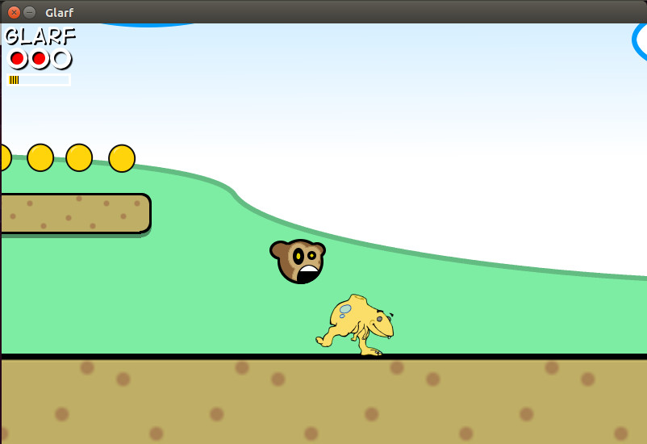

Scroll, Jump and Beguile (aka Glarf)
====================================

A Pygame game from 2006

CREDITS
=======

Cast By Order Of Appearance

Pete Shinners - Before Recorded History
 * pygame
 * The Line-By-Line Chimp Tutorial

Shandy Brown - 2003
 * modified the LBLCT to the Monkeystomp gamelet
 * modified Monkeystomp to the Scroll, Jump, and Beguile gamelet
 * started the Glarf coding project

Leigh Brown - 2005
 * character design
 * character animation

Denise Hartley - 2005
 * colorization research

John Robinson - 2005
 * songs

Jack Nutting - 2005
 * Mac OS X build
